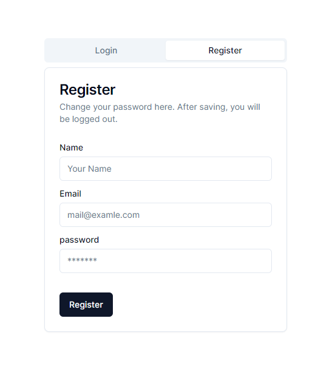
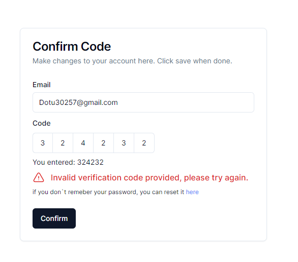

<!-- Description -->
# Next.js with AWS Cognito + Amplify

This project demonstrates how to integrate AWS Cognito with a Next.js application. It uses the AWS Amplify library to interact with the Cognito user pool and authenticate users.

## Features
- User registration and login using AWS Cognito.
- Customized login and registration pages.
- User authentication and session management.
- Protected routes and access control.
- User profile management and settings.


## Getting Started
### Creating a User Pool and App Client in AWS Cognito

#### 1. Create a User Pool

- Log in to the AWS Management Console and navigate to Cognito.
- Create a new User Pool.
- Configure settings such as password policies and multi-factor authentication.
- Proceed to create the User Pool.

#### 2. Create an App Client

- Inside the User Pool settings, navigate to "App clients".
- Add a new app client.
- Specify options like client secret and authentication methods.
- Create the app client.

#### 3. Configure and Use

- Use the App Client ID and User Pool ID in your application integration.
- Customize login and registration pages as required.
- Test and deploy your application.

These steps will help you set up user authentication and management using AWS Cognito for your applications.

### Setting Up the Project
<!-- modify file .env.example -->
- Modify the `.env.example` file to include your AWS Cognito User Pool ID and App Client ID.
- Rename the file to `.env`.

### Running the Project
```bash
npm install
npm run dev
```

### Custome UI
<!-- import images from ./public/docs -->
- Register Page


- Confirm Page



Open [http://localhost:3000](http://localhost:3000) with your browser to see the result.

# amplify-cognito
